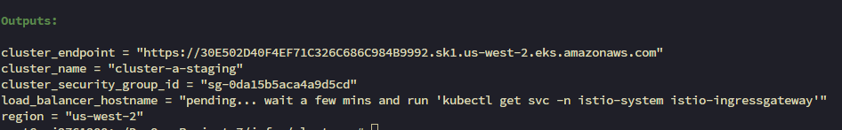
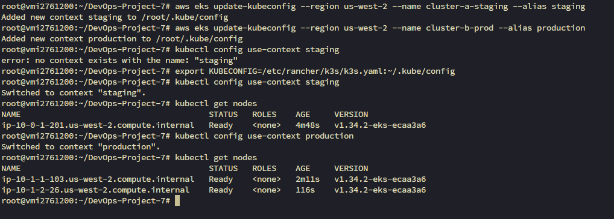
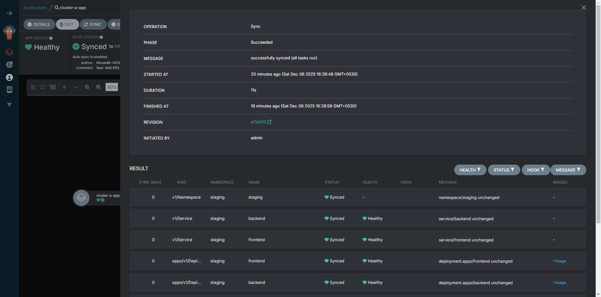
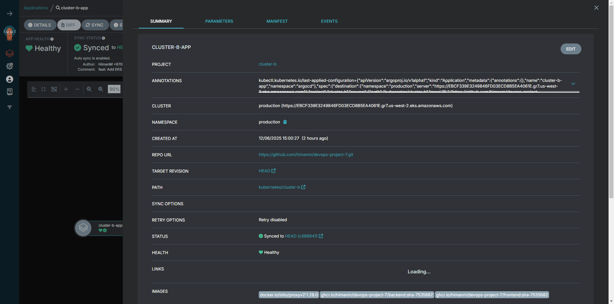
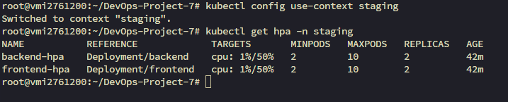
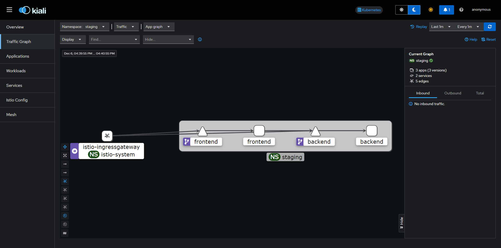
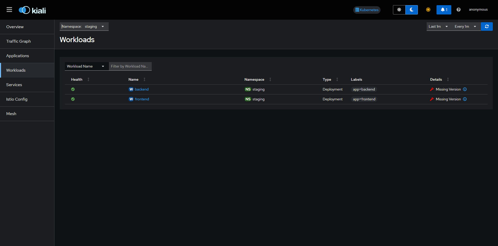
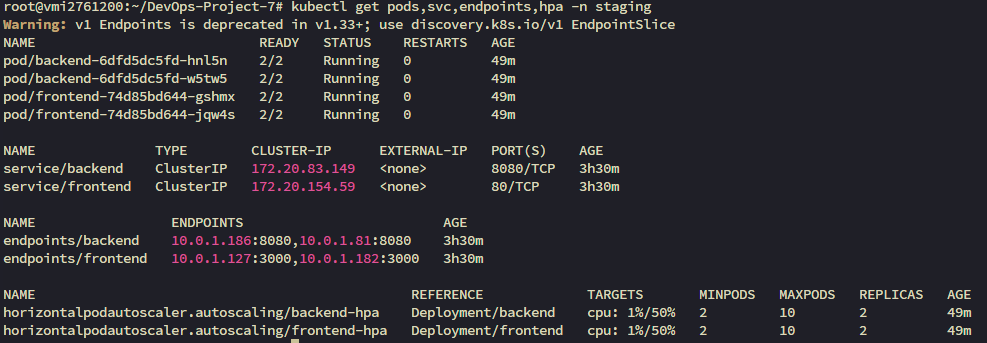
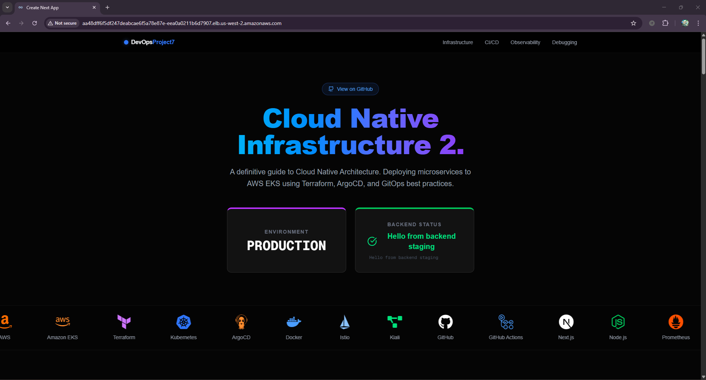
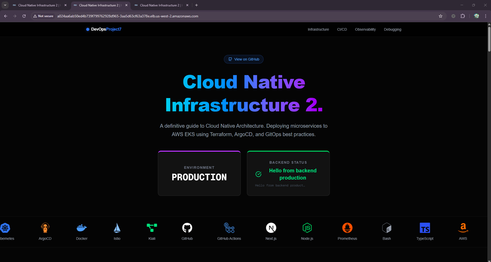

# DevOps Project 7: End-to-End GitOps with EKS, ArgoCD, and HPA

> A comprehensive learning project demonstrating End-to-End GitOps workflows with dual EKS clusters, ArgoCD continuous delivery, and Horizontal Pod Autoscaling

## Description

This project demonstrates a production-grade DevOps solution for deploying microservices (Node.js Backend and Next.js Frontend) to Amazon Elastic Kubernetes Service (EKS) using modern GitOps practices. It showcases Infrastructure as Code (IaC) with Terraform, declarative continuous delivery with ArgoCD, automated CI/CD pipelines with GitHub Actions, and multi-environment deployment strategies across isolated Staging and Production clusters.

## Table of Contents

1. [About This Project](#about-this-project)
2. [Technologies Used](#technologies-used)
3. [Techniques & Concepts](#techniques--concepts)
4. [Architecture](#architecture)
5. [Prerequisites](#prerequisites)
6. [Getting Started](#getting-started)
7. [Setup Instructions](#setup-instructions)
   - [Step 1: Infrastructure Provisioning](#step-1-infrastructure-provisioning)
   - [Step 2: Configure Kubernetes Access](#step-2-configure-kubernetes-access)
   - [Step 3: ArgoCD Setup](#step-3-argocd-setup)
8. [Horizontal Pod Autoscaling](#horizontal-pod-autoscaling)
9. [Observability](#observability)
10. [Environment-Specific Builds](#environment-specific-builds)
11. [Verification](#verification)
12. [Screenshots/Visual Reference](#screenshotsvisual-reference)
13. [License](#license)
14. [Author](#author)

---

## About This Project

This project is built for **learning DevOps, GitOps, and multi-environment deployment** with hands-on experience using real-world tools and best practices. It demonstrates:

- **Multi-cluster architecture**: Separate EKS clusters for Staging and Production environments
- **GitOps methodology**: Git as the single source of truth for infrastructure and application state
- **Automated CI/CD**: GitHub Actions for building, tagging, and updating manifests
- **Declarative deployment**: ArgoCD for continuous delivery across multiple clusters
- **Auto-scaling**: Horizontal Pod Autoscaling based on CPU metrics
- **Service mesh observability**: Istio with Kiali and Prometheus for traffic visualization and monitoring

This is an educational project designed to help you understand enterprise-grade deployment patterns and DevOps workflows that are used in production environments.

## Technologies Used


**Core Technologies:**
- **AWS EKS (v1.34)** - Managed Kubernetes clusters for Staging and Production
- **Terraform** - Infrastructure as Code for automated cloud resource provisioning
- **ArgoCD** - GitOps continuous delivery tool for Kubernetes
- **Istio (v1.28.0)** - Service mesh for traffic management and security
- **Prometheus** - Metrics collection and monitoring
- **Kiali** - Service mesh observability dashboard
- **GitHub Actions** - CI/CD pipeline automation
- **GitHub Container Registry (GHCR)** - Docker image storage
- **Node.js & Express** - Backend microservice
- **Next.js** - Frontend application
- **Amazon Linux 2023** - Optimized node operating system

## Techniques & Concepts

This project demonstrates the following DevOps techniques and concepts:

- **GitOps**: Using Git as the single source of truth for declarative infrastructure and applications
- **Infrastructure as Code (IaC)**: Terraform for reproducible and version-controlled infrastructure
- **Multi-Environment Deployment**: Isolated Staging and Production environments with separate EKS clusters
- **Continuous Integration**: Automated builds and image tagging with GitHub Actions
- **Continuous Delivery**: Automated deployment synchronization with ArgoCD
- **Horizontal Pod Autoscaling**: Dynamic pod scaling based on CPU utilization
- **Service Mesh**: Traffic management, security, and observability with Istio
- **Observability**: Metrics collection with Prometheus and visualization with Kiali
- **Environment Isolation**: Separate clusters to prevent staging issues from affecting production
- **Declarative Configuration**: Kubernetes manifests managed with Kustomize
- **Container Registry**: Automated image publishing to GHCR
- **Branch-Based Deployment**: Feature branches deploy to Staging, main branch deploys to Production

## Architecture

This project employs a **GitOps** methodology where the Git repository is the single source of truth for the infrastructure and application state.

### Dual-Cluster Setup

The project uses two separate EKS clusters for complete environment isolation:

- **Cluster A (Staging)**: Development and testing environment, also hosts the ArgoCD control plane
- **Cluster B (Production)**: Production environment for stable releases

### CI/CD Workflow

The pipeline is fully automated using **GitHub Actions** and **ArgoCD**:

#### 1. Feature Development (Feature Branches → Staging)
- Developers push code to a feature branch (non-`main`)
- **GitHub Actions** automatically triggers and:
  - Builds the Docker image for both backend and frontend
  - Tags the image with the commit SHA
  - Pushes the image to **GitHub Container Registry (GHCR)**
  - Updates the **Staging Manifests** (`kubernetes/cluster-a`) with the new image tag
  - Commits the manifest changes back to the repository

#### 2. Staging Deployment (Automatic)
- **ArgoCD** (running on Cluster A) continuously monitors the Git repository
- Detects the manifest changes in the `kubernetes/cluster-a` directory
- Automatically syncs the **Staging Cluster** to match the new state
- The feature is deployed to Staging for testing and verification

#### 3. Production Promotion (Main Branch → Production)
- After testing in Staging, a Pull Request (PR) is merged to the `main` branch
- **GitHub Actions** triggers again and:
  - Updates the **Production Manifests** (`kubernetes/cluster-b`) with the verified image tag
  - Commits the changes to the repository
- **ArgoCD** syncs the **Production Cluster** (Cluster B) to the new state
- Production deployment is complete

### Technology Stack Flow

```
┌─────────────┐     ┌──────────────┐     ┌─────────────┐
│   GitHub    │────▶│GitHub Actions│────▶│    GHCR     │
│ Repository  │     │   (CI/CD)    │     │   (Images)  │
└─────────────┘     └──────────────┘     └─────────────┘
      │                     │                     │
      │                     ▼                     │
      │            ┌──────────────┐              │
      └───────────▶│   ArgoCD     │◀─────────────┘
                   │  (Cluster A) │
                   └──────────────┘
                          │
                ┌─────────┴─────────┐
                ▼                   ▼
        ┌──────────────┐    ┌──────────────┐
        │  Cluster A   │    │  Cluster B   │
        │  (Staging)   │    │ (Production) │
        └──────────────┘    └──────────────┘
```

**Key Components:**
- **Infrastructure**: Terraform provisions VPCs, Subnets, NAT Gateways, and EKS Clusters
- **Orchestration**: AWS EKS v1.34 manages container workloads across both clusters
- **GitOps**: ArgoCD monitors Git repository and maintains desired state
- **Service Mesh**: Istio handles traffic management, mTLS, load balancing, and observability
- **Monitoring**: Prometheus scrapes metrics for HPA decisions and dashboards
- **Visualization**: Kiali provides real-time service mesh traffic graphs

### Repository Structure

```
.
├── backend/              # Node.js Express backend service
├── frontend/             # Next.js frontend application
├── infra/
│   ├── cluster-a/       # Terraform config for Staging cluster
│   └── cluster-b/       # Terraform config for Production cluster
├── kubernetes/
│   ├── cluster-a/       # Staging Kubernetes manifests
│   └── cluster-b/       # Production Kubernetes manifests
├── argocd/
│   ├── projects/        # ArgoCD project definitions
│   ├── apps/            # ArgoCD application definitions
│   └── namespaces/      # Namespace configurations
├── .github/workflows/   # GitHub Actions CI/CD pipeline
└── docs/                # Documentation and screenshots
```

## Prerequisites

Before starting, ensure you have the following tools installed and configured:

- **AWS CLI** - Configured with appropriate IAM permissions (Administrator or equivalent access to create VPCs, EKS clusters, IAM roles, etc.)
- **Terraform** - Version 1.0 or higher for infrastructure provisioning
- **kubectl** - Kubernetes command-line tool for cluster management
- **ArgoCD CLI** - For ArgoCD configuration and management
- **Git** - For cloning the repository and version control
- **GitHub Account** - With a repository that has "Read and write permissions" enabled for GitHub Actions workflows

> [!NOTE]
> Ensure your AWS CLI is configured with the correct region (us-west-2 by default in this project).

## Getting Started

To clone and replicate this project:

1. **Fork or Clone the Repository**
   ```bash
   git clone https://github.com/HimanM/DevOps-Project-7.git
   cd DevOps-Project-7
   ```

2. **Configure GitHub Actions Permissions**
   - Go to your GitHub repository → **Settings** → **Actions** → **General**
   - Under "Workflow permissions", select **"Read and write permissions"**
   - Click **Save**

3. **Set Up AWS Credentials**
   ```bash
   # Configure AWS CLI with your credentials
   aws configure
   ```
   Enter your AWS Access Key ID, Secret Access Key, and preferred region (e.g., us-west-2).

4. **Follow the Setup Instructions below** to provision infrastructure and deploy applications.

## Setup Instructions

Follow these step-by-step instructions to set up the complete GitOps pipeline with dual EKS clusters.

### Step 1: Infrastructure Provisioning

We use Terraform to provision two separate EKS clusters with all necessary networking and security configurations.

#### Deploy Staging Cluster (Cluster A)

```bash
cd infra/cluster-a
terraform init
terraform apply --auto-approve
```

**What this does:**
- Initializes Terraform and downloads required provider plugins (AWS, Kubernetes, Helm)
- Creates a VPC with public and private subnets across multiple availability zones
- Provisions an EKS cluster (v1.34) named `cluster-a-staging`
- Installs Istio service mesh (v1.28.0) for traffic management
- Deploys Prometheus for metrics collection
- Configures IAM roles and security groups
- Sets up an Application Load Balancer for external access



#### Deploy Production Cluster (Cluster B)

```bash
cd ../cluster-b
terraform init
terraform apply --auto-approve
```

**What this does:**
- Creates a completely separate production environment
- Provisions an EKS cluster (v1.34) named `cluster-b-prod`
- Installs the same Istio and Prometheus stack for consistency
- Ensures environment isolation from the staging cluster
- Configures production-grade networking and security


#### Retrieve Load Balancer URLs

After provisioning, retrieve the Load Balancer URLs to access your applications:

```bash
cd ../..
./get_cluster_outputs.sh
```

**What this does:**
- Queries Terraform state for both clusters
- Extracts the external DNS names of the Application Load Balancers
- Displays the URLs where your applications will be accessible


### Step 2: Configure Kubernetes Access

Configure your local `kubectl` to interact with both EKS clusters:

```bash
# Add Staging cluster to kubeconfig
aws eks update-kubeconfig --region us-west-2 --name cluster-a-staging --alias staging

# Add Production cluster to kubeconfig
aws eks update-kubeconfig --region us-west-2 --name cluster-b-prod --alias production
```

**What this does:**
- Downloads cluster authentication certificates from AWS
- Adds cluster configurations to your local `~/.kube/config` file
- Creates aliases (`staging` and `production`) for easy context switching
- Enables `kubectl` commands to interact with both clusters

**Verify connectivity:**

```bash
# Check Staging cluster
kubectl config use-context staging
kubectl get nodes

# Check Production cluster
kubectl config use-context production
kubectl get nodes
```

**What this does:**
- Switches between cluster contexts
- Lists all worker nodes in each cluster to verify connectivity
- Confirms that EKS clusters are healthy and ready



### Step 3: ArgoCD Setup

ArgoCD is installed on the Staging cluster (Cluster A) and manages deployments to both environments.

#### Install ArgoCD

```bash
kubectl config use-context staging
kubectl create namespace argocd
kubectl apply -n argocd -f https://raw.githubusercontent.com/argoproj/argo-cd/stable/manifests/install.yaml
```

**What this does:**
- Creates a dedicated `argocd` namespace in the Staging cluster
- Installs ArgoCD controllers, API server, and UI components
- Sets up RBAC permissions for GitOps automation
- Deploys the ArgoCD application management system

#### Access ArgoCD UI

```bash
# Port-forward ArgoCD server to localhost
kubectl port-forward svc/argocd-server -n argocd 8081:443

# Get the initial admin password
kubectl -n argocd get secret argocd-initial-admin-secret -o jsonpath="{.data.password}" | base64 -d
```

**What this does:**
- Creates a secure tunnel to the ArgoCD web interface on `https://localhost:8081`
- Retrieves the auto-generated admin password from Kubernetes secrets
- Enables browser access to the ArgoCD dashboard

#### Login to ArgoCD CLI

```bash
argocd login localhost:8081 --username admin --password <password-from-previous-step> --insecure
```

**What this does:**
- Authenticates the ArgoCD CLI with the server
- Enables command-line management of ArgoCD applications
- The `--insecure` flag bypasses certificate validation for local development

#### Register Production Cluster

```bash
argocd cluster add production
```

**What this does:**
- Registers the Production cluster (Cluster B) with ArgoCD
- Installs a ServiceAccount in Cluster B for ArgoCD access
- Enables ArgoCD (running on Cluster A) to deploy to Cluster B
- Sets up cross-cluster communication


#### Configure ArgoCD Applications

```bash
# Apply ArgoCD projects (logical groupings)
kubectl apply -f argocd/projects/project-cluster-a.yaml
kubectl apply -f argocd/projects/project-cluster-b.yaml

# Apply ArgoCD applications (deployment configurations)
kubectl apply -f argocd/apps/cluster-a-app.yaml
kubectl apply -f argocd/apps/cluster-b-app.yaml
```

**What this does:**
- Creates ArgoCD projects to organize applications
- Defines two ArgoCD applications: one for Staging, one for Production
- Configures source repositories (this Git repo) and destination clusters
- Sets up automatic sync policies for GitOps automation
- Tells ArgoCD which Kubernetes manifests to watch and deploy


#### Verify ArgoCD Sync Status

After a few moments, ArgoCD will sync the applications. Check the status:

**Staging Sync Status:**


**Production Sync Status:**


## Horizontal Pod Autoscaling

Horizontal Pod Autoscaling (HPA) is configured to automatically scale application pods based on resource utilization metrics.

### HPA Configuration

The HPA is set up with the following parameters:

- **Target CPU Utilization**: 50% - Scales when average CPU usage exceeds 50%
- **Minimum Replicas**: 2 - Always maintains at least 2 pods for high availability
- **Maximum Replicas**: 10 - Can scale up to 10 pods during peak load
- **Metrics Source**: Kubernetes Metrics Server (deployed with EKS)

### How It Works

1. **Metrics Collection**: Prometheus and Metrics Server continuously collect CPU/memory metrics from pods
2. **Threshold Monitoring**: HPA controller checks if current utilization exceeds target (50% CPU)
3. **Automatic Scaling**: When threshold is breached, HPA increases replica count
4. **Scale Down**: After load decreases and metrics stabilize below target, HPA scales down gradually
5. **Safety Limits**: Always maintains between 2-10 replicas for stability

### Verification

Check HPA status in both environments:

```bash
# Staging HPA status
kubectl get hpa -n staging

# Production HPA status
kubectl get hpa -n production
```

**Staging HPA Status:**


**Production HPA Status:**


## Observability

The project includes comprehensive observability through Istio service mesh, Kiali dashboards, and Prometheus metrics.

### Kiali Dashboard

Kiali provides real-time visualization of your service mesh, including traffic flows, service dependencies, and health status.

#### Access Kiali

```bash
# Port-forward Kiali service
kubectl -n istio-system port-forward svc/kiali 20001:20001 --address 0.0.0.0
```

**What this does:**
- Creates a tunnel to the Kiali dashboard running in the Istio system namespace
- Makes the dashboard accessible at `http://localhost:20001`
- Provides real-time service mesh visualization

#### Features

- **Traffic Graph**: Visualize service-to-service communication in real-time
- **Application View**: See all applications and their health status
- **Workload Monitoring**: Track deployments, replica sets, and pods
- **Service Metrics**: View request rates, error rates, and latency
- **Mesh Configuration**: Validate Istio configurations and policies

### Staging Environment Observability

**Traffic Graph:**


**Applications:**


**Workloads:**


### Production Environment Observability

**Traffic Graph:**


**Mesh Overview:**


### Prometheus Metrics

Prometheus collects and stores time-series metrics from all services:

- **Pod Metrics**: CPU, memory, network I/O
- **Application Metrics**: Request rates, response times, error rates
- **HPA Metrics**: Used by Horizontal Pod Autoscaler for scaling decisions
- **Istio Metrics**: Service mesh traffic statistics and latency measurements

## Environment-Specific Builds

The CI/CD pipeline builds Docker images with different environment configurations based on the Git branch, ensuring proper separation between Staging and Production.

### Branch-Based Configuration

**Feature Branches (non-main):**
- Environment variable: `NODE_ENV=staging`
- Image tag format: `ghcr.io/<username>/app:staging-<commit-sha>`
- Target deployment: Cluster A (Staging)
- Kubernetes manifests updated: `kubernetes/cluster-a/`
- Purpose: Testing new features in isolation

**Main Branch:**
- Environment variable: `NODE_ENV=production`
- Image tag format: `ghcr.io/<username>/app:prod-<commit-sha>`
- Target deployment: Cluster B (Production)
- Kubernetes manifests updated: `kubernetes/cluster-b/`
- Purpose: Stable production releases

### Build Process

The GitHub Actions workflow (`.github/workflows/deploy.yml`) performs the following steps:

1. **Checkout Code**: Clones the repository
2. **Build Docker Images**: Builds backend and frontend with environment-specific configs
3. **Tag Images**: Tags with commit SHA for traceability
4. **Push to GHCR**: Uploads images to GitHub Container Registry
5. **Update Manifests**: Modifies Kubernetes deployment files with new image tags
6. **Commit Changes**: Pushes updated manifests back to the repository
7. **Trigger ArgoCD**: ArgoCD detects changes and syncs to the appropriate cluster


## Verification

After completing the setup, verify that everything is working correctly in both environments.

### Verify Cluster Resources

Check the status of pods, services, endpoints, and HPA in both clusters:

```bash
# Staging cluster verification
kubectl config use-context staging
kubectl get pods,svc,endpoints,hpa -n staging

# Production cluster verification
kubectl config use-context production
kubectl get pods,svc,endpoints,hpa -n production
```

**What to look for:**
- All pods should be in `Running` state
- Services should have `ClusterIP` and `LoadBalancer` endpoints
- HPA should show current/target metrics
- No pods should be in `CrashLoopBackOff` or `Error` state

**Staging Resources:**


**Production Resources:**


### Verify Application Access

Test the applications through the Load Balancer URLs:

```bash
# Get the Load Balancer URLs
cd infra/cluster-a && terraform output load_balancer_hostname
cd ../cluster-b && terraform output load_balancer_hostname
```

Open the URLs in your browser to verify:
- **Staging**: Frontend should display with staging configuration
- **Production**: Frontend should display with production configuration

### Verify ArgoCD Sync

Check that ArgoCD has successfully synced both applications:

```bash
# List all ArgoCD applications
argocd app list

# Get detailed status
argocd app get cluster-a-app
argocd app get cluster-b-app
```

Both applications should show:
- **Sync Status**: `Synced`
- **Health Status**: `Healthy`
- **Last Sync**: Recent timestamp

### Verify HPA Functionality

Monitor HPA behavior under load:

```bash
# Watch HPA metrics in real-time
kubectl get hpa -n staging --watch
kubectl get hpa -n production --watch
```

### Verify Service Mesh

Check that Istio is properly managing traffic:

```bash
# Verify Istio injection
kubectl get namespace -L istio-injection

# Check Istio sidecar proxies
kubectl get pods -n staging -o jsonpath='{.items[*].spec.containers[*].name}'
```

Each pod should have an `istio-proxy` sidecar container.

## Screenshots/Visual Reference

Below are all the visual references demonstrating the complete setup and functionality of the project.

### Infrastructure & Setup

**Staging Cluster Terraform Output:**


**Production Cluster Terraform Output:**


**Cluster Outputs Script:**


**Kubeconfig Configuration:**


### ArgoCD Configuration

**Adding Clusters to ArgoCD:**


**ArgoCD Applications Dashboard:**


**Staging ArgoCD Sync Status:**


**Production ArgoCD Sync Status:**


### Application Frontends

**Staging Application:**


**Production Application:**


### Horizontal Pod Autoscaling

**Staging HPA Status:**


**Production HPA Status:**


### Observability - Kiali Dashboards

**Staging Kiali Traffic Graph:**


**Staging Kiali Applications:**


**Staging Kiali Workloads:**


**Production Kiali Traffic Graph:**


**Production Kiali Mesh Overview:**


### CI/CD Pipeline

**GitHub Actions Workflow:**


### Resource Verification

**Staging Kubectl Resources:**


**Production Kubectl Resources:**


## License

This project is licensed under the MIT License - free to use for educational and learning purposes.

## Author

**Himan M**

- GitHub: [@HimanM](https://github.com/HimanM)
- Project Repository: [DevOps-Project-7](https://github.com/HimanM/DevOps-Project-7)

---

> [!NOTE]
> This is an educational project designed for learning DevOps practices. Feel free to fork, modify, and use it for your own learning journey!

> [!IMPORTANT]
> Remember to tear down AWS resources after testing to avoid unnecessary costs:
> ```bash
> cd infra/cluster-a && terraform destroy --auto-approve
> cd ../cluster-b && terraform destroy --auto-approve
> ```
